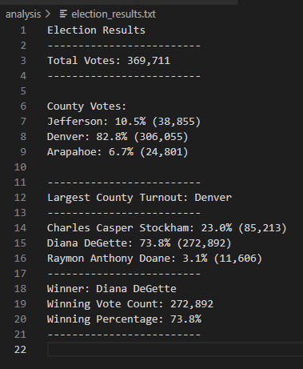

# Election_Analysis
## Overview of Election Audit:
This election audit analysis is to show the total votes and the votes that each candidate receive. 
## Election-Audit Results:
### 。How many votes were cast in this congressional election?

The total vote in this election is 369,711.
### 。Provide a breakdown of the number of votes and the percentage of total votes for each county in the precinct.

Jefferson had 38,855 votes and the percentage of total votes is 10.5%.

Denver had 306,055 votes and the percentage of total votes is 82.8%.

Arapahoe had 24,801 votes and the percentage of total votes is 6.7%.

### 。Which county had the largest number of votes?

Denver is the county that had the largest number of votes.

### 。Provide a breakdown of the number of votes and the percentage of the total votes each candidate received.

Charles Casper Stockham had 85,213 votes and the percentage of total votes is 23.0%.

Diana DeGette had 272,892 votes and the percentage of total votes is 73.8%.

Raymon Anthony Doane had 11,606 votes and the percentage of total votes is 3.1%.

### 。Which candidate won the election, what was their vote count, and what was their percentage of the total votes?

The winner of the election is Diana DeGette who received 272,892 votes and had 73.8% winning percentage.

 
(election_result)

## Election-Audit Summary:

This script can be used in any election.
For example, by using nested for loop and array variables we can rank every candidate base on the votes, this also fit in a competition that score every player.

In addition to, if we get more infomation like the population of each county then we can calculate the vote rate of each county to see is there enough people to participate in the election and even to analysis that how does people think about the election.